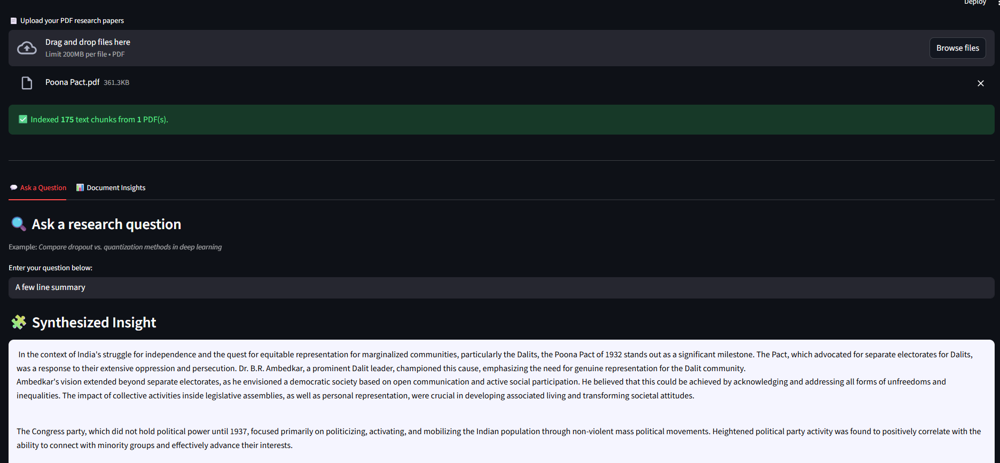

# Retrieval Augmentation Generation Synthesizer

A cost-free Retrieval-Augmented Generation (RAG) application that lets you upload multiple technical PDFs and 
generate cross-document insights using open-source models.
It uses **LangChain**, **FAISS**, and **Hugging Face** models to provide accurate, structured answers — entirely without paid APIs.

---

## 🖼️ Preview


<p align="center">
  
</p>

---


## ✨ Features

-  **Multi-PDF ingestion**: Upload multiple research papers or reports.  
-  **Semantic chunking**: Splits and indexes text using Sentence Transformers.  
-  **FAISS vector search**: Fast, local retrieval of relevant document passages.  
-  **Open-source LLMs**: Uses Hugging Face-hosted or local models (Mistral, Llama, TinyLlama, etc.).  
-  **LangChain-powered RAG**: Combine retrieval and generation in one step.  
-  **Streamlit UI with Plotly**: Simple, interactive visualization of sources and document contributions.  
-  **No API costs or cloud lock-in**: Everything runs locally. 

## 🚀 Run Locally

```bash
# 1️⃣ Install dependencies
pip install -r requirements.txt

# 2️⃣ Get your own Hugging Face token
# Visit https://huggingface.co/settings/tokens
# Create a "Read" and "Inference" access token and copy it.

# 3️⃣ Add your token to a .env file in the project root

# 4️⃣ Run the Streamlit app
streamlit run app_main.py
